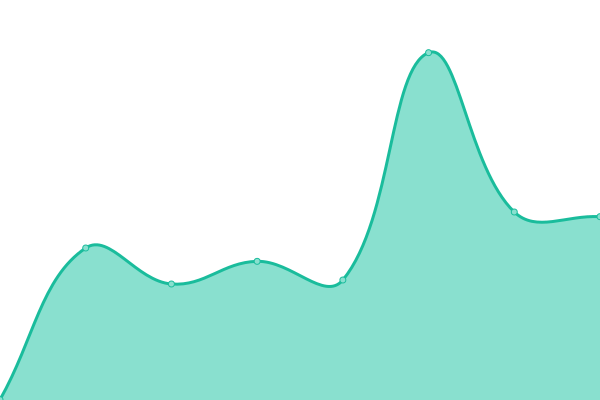

# [📈 Live Status](https://OsePedro.github.io/upptime): <!--live status--> **🟩 All systems operational**

This repository contains the open-source uptime monitor and status page for [Ose Pedro](http://rawmoose.com), powered by [Upptime](https://github.com/upptime/upptime).

With [Upptime](https://upptime.js.org), you can get your own unlimited and free uptime monitor and status page, powered entirely by a GitHub repository. We use [Issues](https://github.com/OsePedro/upptime/issues) as incident reports, [Actions](https://github.com/OsePedro/upptime/actions) as uptime monitors, and [Pages](https://OsePedro.github.io/upptime) for the status page.

<!--start: status pages-->
<!-- This summary is generated by Upptime (https://github.com/upptime/upptime) -->
<!-- Do not edit this manually, your changes will be overwritten -->
<!-- prettier-ignore -->
| URL | Status | History | Response Time | Uptime |
| --- | ------ | ------- | ------------- | ------ |
|  [mwaro](https://mwaro.com/5SR/) | 🟩 Up | [mwaro.yml](https://github.com/OsePedro/upptime/commits/HEAD/history/mwaro.yml) | 

 436ms
     
 | 

<a href="https://OsePedro.github.io/upptime/history/mwaro">100.00%</a>
    

|  [rawmoose](https://rawmoose.com/) | 🟩 Up | [rawmoose.yml](https://github.com/OsePedro/upptime/commits/HEAD/history/rawmoose.yml) | 

 445ms
     
 | 

<a href="https://OsePedro.github.io/upptime/history/rawmoose">100.00%</a>
    

|  [Reggie Pedro](https://reggiepedro.com/) | 🟩 Up | [reggie-pedro.yml](https://github.com/OsePedro/upptime/commits/HEAD/history/reggie-pedro.yml) | 

 423ms
     
 | 

<a href="https://OsePedro.github.io/upptime/history/reggie-pedro">100.00%</a>
    

|  [The Blackett Lab Family](https://theblackettlabfamily.com/) | 🟩 Up | [the-blackett-lab-family.yml](https://github.com/OsePedro/upptime/commits/HEAD/history/the-blackett-lab-family.yml) | 

 550ms
     
 | 

<a href="https://OsePedro.github.io/upptime/history/the-blackett-lab-family">100.00%</a>
    

<!--end: status pages-->

[**Visit our status website →**](https://OsePedro.github.io/upptime)

## 📄 License

- Powered by: [Upptime](https://github.com/upptime/upptime)
- Code: [MIT](./LICENSE) © [Ose Pedro](http://rawmoose.com)
- Data in the `./history` directory: [Open Database License](https://opendatacommons.org/licenses/odbl/1-0/)
